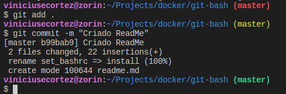

# Bash with git

## Sobre
Esse software coloca na configuração do bash uma flag mostrando a branch atual e se tem arquivos em unstage, stage ou se tudo está commitado.

## Como se instalar

[baixar](https://raw.githubusercontent.com/viniciusecortez/bash_with_git/master/bash_with_git)
~~~
./bash-with-git install
~~~

## Exemplos
Regra | Cor
---|---
Nada a commitar | Verde
Alterações na stage area(quando você dá o git add ) | Amarelo
Coisas a commitar sem coisas no stage area | Vermelho

